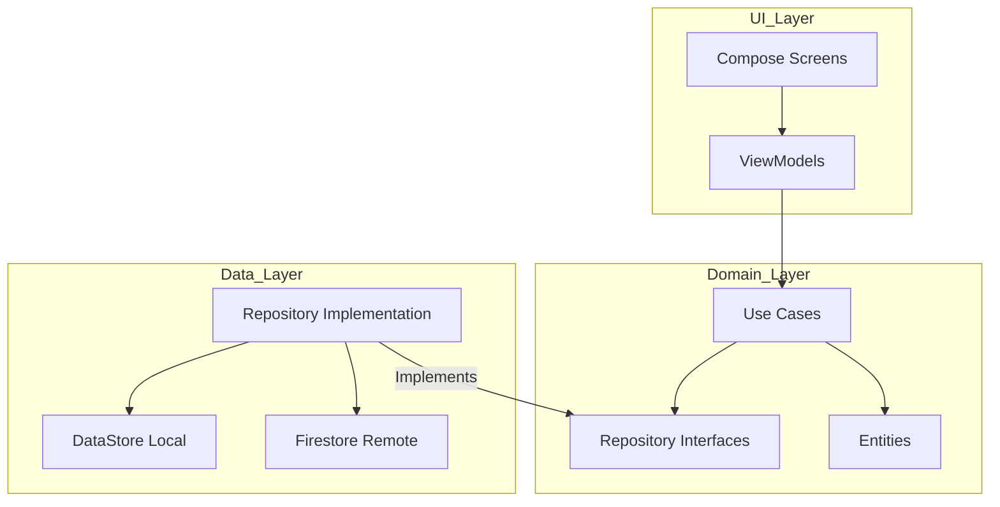
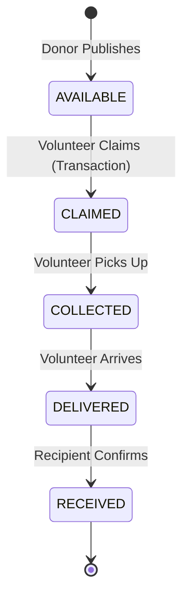
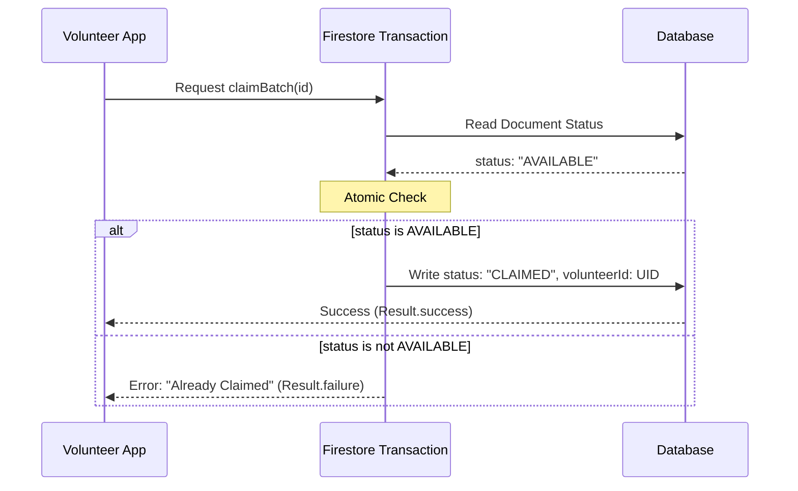

# Supplies Rescue System

## Project Overview
The Supplies Rescue System is a real-time logistics platform designed to optimize food rescue operations. It facilitates the coordination between food donors (restaurants, supermarkets), volunteers (drivers), and recipients (shelters, NGOs) to ensure surplus food is rescued and delivered efficiently before expiration.

## Core Architecture
The system is built following Clean Architecture principles and the MVVM (Model-View-ViewModel) pattern to ensure separation of concerns and maintainability.

## Technical Implementation Details

### Rescue Lifecycle and State Management
A rescue batch follows a strict linear state machine to ensure logistical tracking.

### Concurrency and Data Integrity
To prevent race conditions where multiple volunteers might attempt to claim the same rescue batch simultaneously, the system implements atomic Firestore transactions.

### Real-Time Synchronization
The application leverages Firestore's snapshot listeners exposed through Kotlin callbackFlows. This provides a reactive stream of updates to all participants, ensuring that status changes (e.g., from AVAILABLE to CLAIMED) are reflected instantly across the network without manual polling.

### Zero-Media Policy and Optimization
The system is strictly text-based. It does not support image uploads or multimedia processing. This design decision ensures high performance and low data consumption, which is critical for logistics operations in areas with limited network connectivity. All rescue batch descriptions, quantities, and instructions are handled through structured text fields.

### Native Integrations
Logistics are handled via native Android Intents. The application interfaces with external mapping services (e.g., Google Maps) for navigation and communication platforms (e.g., WhatsApp, Phone Dialer) for coordination. This reduces the application's footprint by avoiding heavy third-party SDK integrations.

### Time-Window Validation
Rescue batches include specific pickup windows. The system includes a utility module to parse and validate these time ranges against the device's local time, enabling or disabling workflow actions based on donor-defined constraints.

## Technical Stack
- Language: Kotlin
- UI Framework: Jetpack Compose
- Dependency Injection: Hilt
- Backend: Firebase (Authentication and Cloud Firestore)
- Reactive Programming: Coroutines and StateFlow
- Local Persistence: Jetpack DataStore and SharedPreferences

## Setup Requirements
1. Clone the repository.
2. Place a valid google-services.json file in the app/ directory.
3. Enable Email/Password authentication in the Firebase Console.
4. Deploy the security rules provided in the firestore.rules file to the project's Firestore instance.
5. Synchronize Gradle and build the project using Android Studio.

---
This software is designed for logistical efficiency and social impact through optimized resource management.
